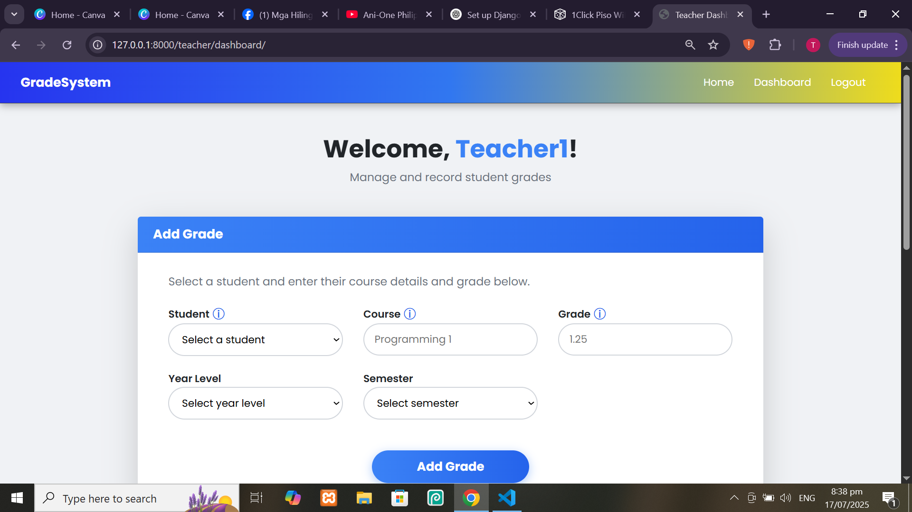

# 🎓 Grade Management System

This is a Django-based web application designed for teachers to **manage student grades** efficiently. It provides a user-friendly dashboard where teachers can add, edit, and delete student grades. The system also supports pagination, searching, and sorting of grade records using **DataTables**.

## 🚀 Features

- 📝 Add student grades by course, year level, and semester
- ✏️ Edit or update existing grades through a modal
- ❌ Delete grades with confirmation modal
- 🔍 Real-time search, pagination, and sorting with DataTables
- 📊 Clean, responsive UI built with Bootstrap

## 📂 Pages

- `/teacher/dashboard/` – Main page to manage student grades
- `/teacher/delete/<id>/` – Deletes selected grade (uses modal confirmation)

## 🛠️ Technologies Used

- Python 3 / Django
- HTML / CSS / Bootstrap 5
- JavaScript (with jQuery)
- [DataTables.js](https://datatables.net/) – for pagination and search functionality

## 📸 Screenshot



## ✅ Installation

1. Clone the repository:
   ```bash
   git clone (https://github.com/secre-alt/grade_system/tree/main)
   
2. Create & Activate Virtual Environment
   ```bash
   python -m venv venv
   # Windows
   venv\Scripts\activate
   # macOS/Linux
   source venv/bin/activate
3. Install Dependencies
   ```bash
   pip install -r requirements.txt
4. Run Migrations
    ```bash
    python manage.py makemigrations
    python manage.py migrate
5. Create a Superuser (Admin)
   ```bash
   python manage.py createsuperuser
6. Start the Server
   ```bash
   python manage.py runserver
Go to: http://127.0.0.1:8000

📌 License
This project is for educational purposes only.


Eldren Dela Cruz – B.S. Information Systems
GitHub: @secre-alt
